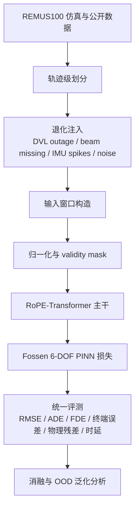
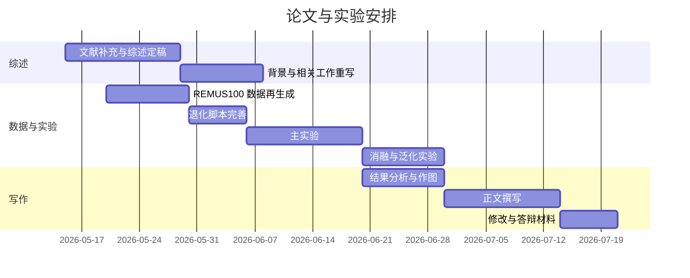

# 深海油气管线巡检场景下退化传感器条件 AUV 短期轨迹预测综述与方法定位

## 执行摘要

本综述面向“深海油气管线巡检”这一高风险、强约束任务，系统梳理近约十余年 AUV 轨迹预测、退化传感器鲁棒导航、REMUS100 仿真平台与物理约束学习相关研究，并据此定位你当前的 **RoPE-Transformer + validity-mask + PINN** 方法。综合文献可以得到三个高置信结论。其一，在深海作业场景中，**INS/DVL 融合仍是主流**，但 DVL 底锁丢失、部分波束缺失、IMU 噪声与惯导漂移会快速引发误差累积，因此“观测退化鲁棒性”不是附加功能，而是底层导航可用性的前提。其二，近年的 BeamsNet、ST-BeamsNet、DVL-denied 深度学习方法已经证明：在 DVL 缺失或不完整条件下，学习式模型能显著改善速度估计与终端定位误差，但多数工作仍聚焦于**速度补偿或滤波辅助**，而非直接解决**短期多步轨迹预测**。其三，PINN、HNN 与 Port-Hamiltonian Neural ODE 一类结构化方法说明，把动力学先验显式写入训练目标，能够提高物理一致性、数据效率与分布外稳定性，尤其适合水下机器人这类采样成本高、控制闭环强的系统。citeturn29view0turn30view0turn32view3turn31view1turn11view0turn16search0turn16search1turn16search2

结合你已上传的初稿与模型文件，你的方法实际上已经踩中了当前公开研究的几个关键空白：你不是单纯做 DVL 补偿，也不是纯数据驱动轨迹外推，而是在 **RoPE 序列建模、严格 validity mask、Fossen 6-DOF 物理残差** 三者之间建立统一框架；同时，你的数据章节已经明确采用 **REMUS100 仿真、轨迹级防泄漏划分、DVL 丢失与 IMU 脉冲噪声注入**。这意味着你最有竞争力的论文定位，不应写成宽泛的“水下机器人通用导航”或“长时轨迹预测”，而应聚焦为：**面向深海油气管线巡检的退化传感器条件下 AUV 短期多步轨迹预测**。这个定位既能与油气场景的安全、实时和完整性管理需求对齐，也能与现有 DVL-outage 文献形成清晰区分。fileciteturn0file0 fileciteturn0file3 fileciteturn0file4

从工程和学术两方面看，你的方法最值得强调的贡献应当是四点：**短期预测而非仅速度重建**，**退化观测显式掩码而非被动插值**，**Fossen 物理残差而非简化运动学正则**，以及**面向油气巡检任务约束的评测协议**。相应地，论文需要用系统实验去证明四个命题：掩码比简单填充更稳健，PINN 比纯 Transformer 更物理一致，短期预测比直接惯导外推或标准序列网络更可靠，以及在 outage 时长增加时性能退化更慢。citeturn30view3turn31view0turn31view1turn11view0turn28view0turn16search2

## 研究计划

本课题的写作与实验建议按“**场景—退化—数据—方法—评测—定位**”的顺序展开。先把油气巡检的任务约束讲清楚，再说明 DVL/IMU 退化为何会破坏导航，然后用 REMUS100 与公开数据集搭建证据链，最后把你的方法放入“经典滤波—模型辅助—深度学习补偿—Transformer—PINN/HNN”这一连续谱系中。

建议你在论文正式写作时采用如下推进路径。首先，用 2–3 页建立应用背景，只讲深海油气管线巡检，不泛泛谈 AUV。然后，用 3–4 页系统综述 DVL 丢失、部分波束缺失、IMU 异常与公开数据集现状。接着，用 4–6 页回顾经典融合导航与学习式补偿方法，并放出第一张方法比较表。再之后，用 2–3 页单独说明你方法的结构优势与研究空白。最后，用一整章设计实验协议，包括数据划分、退化场景、指标体系、消融矩阵与实时性测试，并用统一评测把你的方法与基线拉开差别。

## 文献综述与方法定位

### 深海油气巡检的任务约束

油气管线巡检不是一般性的“水下轨迹预测”问题。它要求 AUV 长时间沿管贴近飞行，在近底复杂地形、局部自由跨与交跨结构、洋流扰动和 GNSS 不可用的环境里维持稳定航迹，同时还要支撑异常识别、复访与任务不中断。DNV-ST-F101 明确把海底管道系统的概念设计、环境调查、材料、腐蚀控制、施工、运行与弃置都纳入统一安全框架；DNV-RP-F116 则强调可实施、可维护、可审计的完整性管理体系。这意味着你的预测模块若面向油气作业，就必须不仅“误差小”，还要能服务于**安全边界保持、完整性证据链和失效安全策略**。citeturn34view1turn10view10

产业侧也已把 AUV 作为深海巡检的重要生产力工具。Oceaneering 的 Freedom AUV 明确主打 **pipeline、flowline、umbilical 的单航次单通道巡检**，强调降低船期、HSE 风险与离岸人员数量；Saipem 的 FlatFish 官方资料显示其具备**3000 m 水深、48 小时续航、约 180 km 水平巡检能力**，面向管线、立管和结构巡检；Kongsberg 则长期把 HUGIN 定位为 subsea survey、mapping 与 pipeline inspection 平台，并在官方资料中强调其面向深海长距离自主巡检的能力。这些资料共同说明，油气行业真正关注的是：**长距离、低风险、高覆盖、可持续作业**，而短期轨迹预测的意义就在于为这些目标提供更鲁棒的底层运动估计。citeturn10view11turn10view12turn10view13turn33view2turn33view4

从国内研究和行业文章看，AUV 在海底管道巡检、溢油检测与三维路径跟踪中的场景化需求同样非常明确。中文文献已经指出 AUV 可用于海底输油管道泄漏检测，并强调快速巡视、精确定位和长时可靠工作的需求；国内综述也把导航控制、检测通信、协同作业视作 AUV 发展的关键方向。这为你把论文背景写成“**面向深海油气管线巡检的退化传感器鲁棒短期预测**”提供了足够合理的中文语境。citeturn27view5turn27view6turn24search4

### 传感器退化与统计建模

DVL 退化是这条研究线上最有共识的问题。官方设备资料说明，DVL 依赖至少三束声束估计相对海底速度；一旦底锁条件被破坏，速度更新就会退化或中断。Nortek 官方页面明确写到 DVL 通过至少三束声束估计海底相对速度，不同型号的 bottom-track 能力约覆盖 **0.1–75 m、0.1–175 m、0.1–200 m 甚至 0.1–375 m**；Sonardyne 的 Syrinx 也强调在不同海底条件下保持 bottom lock 的能力。这说明在近底飞行、高低起伏地形、局部高空越障或海底反射条件不佳时，DVL 丢失是深海巡检中的**第一类系统性退化源**。citeturn26view0turn26view1turn26view2turn26view3

相关研究已经进一步把 DVL 退化细化成几类。ST-BeamsNet 明确指出，**海底不平整、海洋生物遮挡、Roll/Pitch 机动**都可能导致完整 DVL outage；LiBeamsNet 与 2024 年 Data-Driven Strategies for Coping with Incomplete DVL Measurements 则说明，现实场景中常见的并不只有“全失锁”，还包括**部分波束缺失**，此时速度向量仍可能不可恢复或精度显著下降。对论文而言，这意味着退化设计至少应覆盖：**完整 outage、两束缺失、短时片段缺失、长时片段缺失** 四个层次，而不是只做随机点状缺失。citeturn31view1turn31view0turn15search4

IMU 退化在公开水下数据集里较少被明确标注，但在综合导航文献中依然是底层误差主因。综合导航综述指出，纯 INS 难以获得长时高精度导航，必须依赖辅助观测来约束误差积累；与此相呼应，水下和船舶惯导去噪研究表明，低质量 IMU 噪声、偏置和异常会显著破坏无外援或弱外援条件下的导航稳定性。你的论文若采用“高斯噪声 + 偏置漂移 + 稀疏脉冲异常”来描述 IMU 退化，是合理的，但必须诚实说明：**脉冲异常更多是压力测试型实验设定，而不是当前公开 AUV 数据集天然附带的标准标签**。citeturn29view0turn19search2turn19search22

就你现有数据初稿而言，这一部分已经很完整。你已经在 REMUS100 仿真数据上设置了**轨迹级划分**，并采用 **DVL 丢失约 6% 的时间步、IMU 脉冲异常约 3% 的非丢失时间步**，同时叠加位置、速度和姿态高斯噪声，并构建二值 validity mask 来驱动 Transformer 的复合注意力掩码。这种设计与当前公开文献完全同频，而且比很多只做随机零填充的工作更接近“可解释的退化注入”。fileciteturn0file0

### 数据集与 REMUS100 仿真平台

对于你的论文，**REMUS100 + Fossen/MSS** 是最合适的主平台。Fossen 官方 MSS 页面明确提供 `remus100.m` 与 `SIMremus100.m`，作为 **1.9 m 级 REMUS100 AUV 的 6-DOF 非线性模型**；Python Vehicle Simulator 页面则进一步给出 REMUS100 的典型参数，包括长度约 1.9 m、直径约 0.19 m、质量约 31.9 kg、零流条件下最大速度约 2.5 m/s，并支持显式设定海流和控制输入。与单纯从实测轨迹反推状态的工作不同，这个平台的最大价值在于你可以**完全控制动力学、海流、姿态机动和退化注入**，从而得到严格的真值标签。citeturn10view14turn35view0turn38view0

WHOI 对 REMUS100 的官方介绍则给这个平台提供了应用层的合理性。WHOI 把 REMUS100 描述为面向近海与多传感器配置的紧凑型 AUV，可根据任务搭载不同传感器。尽管 WHOI 页面本身更偏平台介绍而非动力学细节，但它足以支撑“REMUS100 是一个真实存在且工程上被广泛使用的水下平台”这一背景陈述。citeturn10view15

公开真实数据方面，当前最相关的几类资源各有用途。2023 年的 **Underwater AUV Navigation Dataset in Natural Scenarios** 给出了高精度光纤惯导、DVL 与深度信息的自然场景数据，可用于补充真实世界的导航误差分析；**AQUALOC** 给出了视觉—惯性—压力数据，场景含几米浅水、270 m 和 380 m 两个近海底环境，体现深水近底定位难度；2026 年 **Tank dataset** 则引入了 stereo + IMU + DVL + depth 的多传感器组合，并提供准确 6-DoF 真值。综合这些描述可以推断：公开数据资源正在改善，但真正同时满足“**AUV + DVL + IMU + 6-DoF 真值 + 显式退化标签 + 油气巡检语义**”的公共基准仍很稀缺，这正是你采用受控 REMUS100 仿真的主要合理性。citeturn36view0turn37view0turn36view3turn36view4

### 方法谱系与对比

经典方法的主线仍然是“**滤波 + 动力学模型 + 辅助观测**”。综合导航综述指出，INS 是 AUV 导航核心，但纯 INS 会因累积误差而失去长程精度；因此，外部辅助是工程上不可回避的设计逻辑。Arnold 与 Medagoda 在 ICRA 2018 的工作是这条路线的代表：他们以 manifold-based UKF 结合 vehicle model、ADCP 与战术级 IMU，在 DVL dropouts 和 bottom-lock loss 条件下保持一致定位，并且明确说明系统可在 FlatFish AUV 的计算资源上实时运行。这类方法的优势是**可解释、工程成熟、实时性强**；不足则是对动力学模型完整性、辅助传感器可用性和参数调优仍高度依赖。citeturn29view0turn28view0turn28view1turn28view2

学习式方法的第一阶段，是把退化条件视为**速度回归**或**速度冗余辅助**问题。2020 年 Ocean Engineering 的 intelligent velocity model 明确针对 DVL dropouts、fish movement、sound scattering 与 overrange 等情况，利用学习式速度模型为标准 AUV 提供冗余速度信息，并在 Sailfish 210 海试数据上报告约 **0.5% 导航精度**。2023 年 Ocean Engineering 的 DVL-denied 对比工作则进一步表明，深度网络已经能够在多个任务航次和专门实验数据上，直接从非 DVL 输入估计 body-frame velocity，用于 dead reckoning 策略。citeturn10view1turn30view0turn30view3

第二阶段则进入了**DVL 波束级缺失与完全 outage 的专门学习**。BeamsNet 把 DVL 速度向量回归做成端到端学习模型，在仿真与 Mediterranean Sea 的 Snapir AUV 海试中采集约四小时数据，并报告对 DVL 速度估计**超过 60% 的改善**。ST-BeamsNet 进一步使用 Set-Transformer 处理 complete DVL outage，在 Snapir 数据上相对 moving average 获得约 **26% 的改进**。2024 年 Data-Driven Strategies for Coping with Incomplete DVL Measurements 又把问题推进到两束缺失场景，报告相对模型方法 **超过 16%** 的速度预测精度提升。这一系列工作非常重要，因为它们证明了：**缺失观测并非只能靠滤波降级运行，而可以被网络显式建模**。citeturn32view3turn32view1turn31view1turn31view0

第三阶段才是与你最接近的 **Transformer + 长时 outage** 路线。2025 年 arXiv/OCEANS 的 Transformer-Based Robust Underwater Inertial Navigation in Prolonged DVL Outages 报告，在最长期至 50 s 的 complete DVL outage 条件下，速度 RMSE 最高改善 **63%**，终端位置误差最高降低 **95%**。但这类工作仍然主要把网络输出嵌回滤波器，重心是“**稳定导航**”，不是“**多步短期轨迹预测**”。换句话说，它们已经证明了 Transformer 在缺失观测和长时序下的价值，但尚未把这一价值与**显示性物理约束、mask 机制和油气巡检短期预测闭环**结合起来。citeturn11view0turn11view1turn11view2

物理约束学习则构成另一条方法线。PINN 的理论基础来自 Raissi 等 2019 年提出的“通过微分方程残差约束神经网络”的框架；HNN 强调从哈密顿结构中学习保守动力学；Port-Hamiltonian Neural ODE on Lie Groups 则直接面向机器人在 \(SE(3)\) 上的动力学表达；2025 年 JMSE 的 Physics-Informed Dynamics Modeling 更已经把 Port-Hamiltonian Neural ODE 用于水下航行器长期动力学预测。对你的研究而言，这条线最关键的启发不是“照搬 HNN”，而是说明：**把动力学等式写进损失函数、并让网络在物理可行域内学习，是水下平台上的前沿且合理的选择**。citeturn16search0turn16search1turn16search6turn21search1

### 对你的方法的定位

从你提供的模型文档看，你的方法已经具备明显的“统一框架”特征：主干是 **RoPE-Transformer**，明确使用 **causal + validity mask** 处理缺失/异常时间步，并将 **Fossen 6-DOF 动力学残差** 纳入 PINN 训练目标。这与现有代表文献相比形成了一个相当清晰的差异：BeamsNet/ST-BeamsNet 更偏向速度补偿或波束重建；经典滤波更偏状态估计；而你的方法更适合被表述为**退化观测条件下的短期多步轨迹预测器**，可作为下游控制或故障安全模块的前馈信息源。fileciteturn0file3 fileciteturn0file4

另一个关键区别在于 **validity mask**。RoPE 本身提供长序列与相对位置信息建模能力，但如果缺失帧只是零填充，网络实际上仍可能把“无效观测”学成伪信号。你当前的做法——让掩码参与注意力，而不是只参与输入预处理——更接近缺失观测建模的正确方向。虽然直接针对 AUV 的同类论文还不多，但通用轨迹预测中的 missing-observation Transformer 已明确说明，显式二值缺失事件编码可以提高不完整轨迹上的推断稳定性。因此，你的方法非常适合把“**对缺失数据的结构化处理**”作为主贡献之一。citeturn17search2turn17search6

基于上述文献，可以把你的方法定位为：**一个面向深海油气管线巡检、以 REMUS100 为主验证平台、在 DVL/IMU 退化条件下进行短期多步轨迹预测的物理约束序列模型**。这一定义既不会与传统导航系统争论“谁替代谁”，也能把你的创新点聚焦在最可验证的四个属性上：**数据效率、缺失鲁棒性、物理一致性、实时可部署性**。这也是最容易写成高质量综述与方法章节的方式。citeturn35view0turn31view1turn11view0turn16search2

### 数据集比较表

下表基于官方数据集说明与论文摘要，对最相关的数据/仿真平台做归纳。表中的“适合程度”是基于上述文献的综合判断，用于服务论文实验设计。citeturn10view14turn35view0turn36view0turn37view0turn36view3

| 数据/平台 | 观测配置 | 是否有 6-DoF 真值 | 是否可控退化注入 | 与油气巡检贴近度 | 适合你的程度 |
|---|---|---:|---:|---:|---:|
| REMUS100 + MSS / PythonVehicleSimulator | 可生成位置、姿态、速度、海流、控制输入 | 高 | 高 | 中高 | 很高 |
| Underwater AUV Navigation Dataset 2023 | FOG-INS + DVL + depth | 中 | 低 | 中 | 高 |
| AQUALOC | camera + MEMS-IMU + pressure | 中 | 低 | 中低 | 中 |
| Tank dataset 2026 | stereo + IMU + DVL + depth | 高 | 低 | 低到中 | 中高 |

### 方法比较表

下表不是文献原始实验结果复述，而是对代表方法的综合判断，用来突出你的论文应强调的比较维度。判断依据来自前述经典导航、DVL-outage 深度学习与物理约束学习文献。citeturn28view0turn30view0turn31view1turn11view0turn16search0turn16search2

| 方法类别 | 代表思路 | 数据效率 | 缺失数据鲁棒性 | 可解释性 | 计算成本 | 实时性 | 物理先验集成难度 | 样本复杂度 | 相对你方法 |
|---|---|---|---|---|---|---|---|---|---|
| EKF/UKF/因子图 | INS/DVL/USBL/LBL 融合 | 高 | 中 | 高 | 低到中 | 高 | 低 | 低 | 强基线，但难处理复杂缺失模式 |
| 模型辅助滤波 | Fossen/drag/thrust + ADCP | 高 | 中到高 | 高 | 中 | 高 | 低 | 低 | 工程强，但对建模完整度依赖大 |
| 速度补偿网络 | ELM/LSTM/GRU 回归 body velocity | 中 | 中到高 | 低 | 中 | 中到高 | 中高 | 中 | 能补观测，但目标层较窄 |
| 波束重建网络 | BeamsNet / LiBeamsNet / MissBeamNet | 中 | 高 | 中 | 中 | 中 | 中高 | 中 | 与你的退化目标最接近 |
| Transformer outage 预测 | ST-BeamsNet / prolonged outages | 中 | 高 | 中 | 中 | 中 | 中高 | 中 | 序列建模强，但物理层常偏弱 |
| PINN/HNN/PH-NODE | 物理残差或结构守恒 | 高 | 中 | 高 | 中到高 | 中 | 低 | 中 | 物理一致性强，但缺失观测处理不足 |
| 你的方法 | RoPE + validity mask + Fossen PINN | 预期高 | 预期高 | 中到高 | 中 | 中到高 | 低 | 中 | 最适合写成短期多步轨迹预测 |

## 实验设计与论文写作建议

论文的实验目标建议写成：**在 REMUS100 受控仿真与补充公开数据验证中，评估退化传感器条件下 AUV 短期多步轨迹预测的精度、物理一致性、鲁棒性、实时性与分布外泛化性能**。这样写有两个好处。一是能与经典导航、DVL-denied 学习方法、PINN 结构化方法同时对话。二是能避免把问题写成过大的“全局定位重建”或“所有场景通用预测”。citeturn30view0turn31view0turn16search2

实验分组建议至少覆盖六类场景。第一类是**无退化或轻噪声条件**，保证你的方法在正常观测下不比经典方法差。第二类是 **complete DVL outage**，建议使用连续 **1 s、5 s、10 s、30 s、50 s** 片段，直接与近期 Transformer outage 文献对齐。第三类是**部分波束缺失**，至少做一束缺失、两束缺失。第四类是 **IMU 异常**，区分高斯噪声、偏置漂移和稀疏脉冲。第五类是**复合退化**，即 DVL outage + IMU spikes + 强海流，用于模拟最坏工况。第六类是**分布外泛化**，例如未见过的海流强度、未见过的机动模式和未见过的初始状态。citeturn11view0turn31view0turn31view1turn26view3

### 推荐实验矩阵

| 实验组 | 退化设定 | 关键自变量 | 主要目的 |
|---|---|---|---|
| 正常工况精度 | 无退化 / 轻噪声 | 预测步长 | 证明模型基础精度 |
| DVL 长时失锁 | 1s / 5s / 10s / 30s / 50s outage | 失锁时长 | 检验长时缺失鲁棒性 |
| 部分 DVL 波束缺失 | 缺失 1 beam / 2 beams | beam 数量 | 对齐 BeamsNet 类文献 |
| IMU 异常鲁棒性 | 高斯噪声 / 偏置漂移 / impulsive spikes | 噪声强度 | 检验 validity mask 和 PINN |
| 复合退化 | DVL + IMU + strong current | 组合工况 | 贴近最坏油气作业情形 |
| OOD 泛化 | 未见海流 / 未见机动 / 未见初值 | 分布偏移量 | 检验泛化而非记忆 |
| 实时性 | 不同窗口长度与 batch | 推理时延 | 支撑工程可部署性 |

指标方面，建议至少同时报告 **位置 RMSE、MAE、ADE/FDE、终端误差、速度与航向误差、物理残差统计量、推理时延与参数量**。其中，ADE/FDE 更利于把你的工作与通用轨迹预测对话，RMSE/终端误差更利于与导航文献对话，而物理残差是你相较纯数据驱动方法最关键的“第二坐标系”。如果只报告位置误差，而不报告物理残差与推理时延，你的方法优势会被压缩得很厉害。citeturn30view3turn16search0turn16search2

消融实验必须充足。最重要的不是“多做几个 baselines”，而是让读者清楚看到 **RoPE、validity mask、PINN** 分别贡献了什么。建议最少做以下几组：**无 RoPE、无 validity mask、无 PINN、用简化运动学残差替代 Fossen 残差、短窗口 vs 长窗口、训练样本比例扫描**。这些实验分别对应你的三大主张：长依赖建模、缺失观测处理和物理一致性约束。fileciteturn0file3 fileciteturn0file4

### 推荐评测流程图

### 推荐时间线

## 优先文献注释书目

下表列出最值得优先精读的文献与报告。为便于你后续下载，相关引文本身可直接作为外链入口使用。优先级按“与你课题的直接相关性”而非发表时间排序。citeturn10view14turn35view0turn29view0turn10view1turn30view0turn32view3turn31view1turn31view0turn11view0turn28view0turn16search0turn16search1turn16search6turn21search1turn17search1turn36view0turn37view0turn36view3turn34view1turn10view10

| 文献/报告 | 内容摘要与为何相关 |
|---|---|
| Fossen MSS / Python Vehicle Simulator | 这是 REMUS100 动力学、GNC 与 INS 仿真的核心官方生态。你的仿真、物理残差和可复现实验几乎都应以此为基础。 |
| WHOI REMUS100 官方介绍 | 用于确认平台背景与工程真实性。适合放在平台介绍与研究对象正当性部分。 |
| Bao et al., *Integrated navigation for autonomous underwater vehicles in aquaculture: A review* | 虽非油气专用，但非常适合搭建综合导航综述框架，尤其可用于论证“纯 INS 必然漂移，必须有辅助观测”。 |
| Lv et al., *Intelligent velocity model for standard AUV* | 代表 DVL dropout 条件下的早期学习式速度辅助路线。优点是工程问题定义清楚，缺点是仍停留在速度补偿层。 |
| Topini et al., *Deep Learning strategies for AUV navigation in DVL-denied environments* | 这是 DVL-denied 场景下较系统的深度学习比较研究，适合作为你相关工作中“学习式补偿已经成熟到何种程度”的关键证据。 |
| Cohen & Klein, *BeamsNet* | DVL 波束级学习补偿的代表作，在海试与仿真两端都给出结果，对你设置部分波束缺失基线特别重要。 |
| Cohen et al., *ST-BeamsNet* | 把 complete DVL outage 推到 Transformer 结构，是你方法最直接的近邻文献之一。 |
| Cohen & Klein, *Data-Driven Strategies for Coping with Incomplete DVL Measurements* | 对 incomplete beams 做专门比较，为你设计 beam 缺失实验提供直接依据。 |
| Yampolsky et al., *Transformer-Based Robust Underwater Inertial Navigation in Prolonged DVL Outages* | 目前最接近你“Transformer + 缺失鲁棒”方向的公开工作之一，但其目标还是速度与滤波辅助，而非短期多步轨迹预测。 |
| Arnold & Medagoda, *Robust Model-Aided Inertial Localization for AUVs* | 经典模型辅助导航代表。它非常适合写成你的“工程可解释强基线”。 |
| Raissi et al., *Physics-informed neural networks* | PINN 的理论源头，方法章节与引言里必须引用。 |
| Greydanus et al., *Hamiltonian Neural Networks* | 物理结构学习的奠基文献之一，可用于讨论物理守恒和长期稳定性。 |
| Duong et al., *Port-Hamiltonian Neural ODE Networks on Lie Groups* | 把 SE(3) 机器人动力学与 Hamiltonian 结构结合，为你论证“水下机器人适合结构化物理学习”提供前沿依据。 |
| Jin et al., *Physics-Informed Dynamics Modeling for Underwater Vehicles* | 直接面向水下航行器动力学的 2025 年工作，是你讨论 PINN/HNN 在海洋机器人中最新进展时最重要的文献之一。 |
| Vaswani et al., *Attention Is All You Need* | Transformer 主干的标准来源。 |
| Su et al., *RoFormer* | RoPE 的标准来源。你若把 RoPE 作为创新点写入正文，这篇文献必须直接引用。 |
| Underwater AUV Navigation Dataset in Natural Scenarios | 稀缺的真实 AUV 导航数据资源，含高精度惯导与 DVL。适合作为真实世界泛化补充验证。 |
| AQUALOC | 深海近底视觉—惯性—压力定位数据集，适合说明深海公开数据稀缺且多传感器配置有限。 |
| Tank dataset | 2026 年较新的 underwater 多传感器数据集，含 DVL 和准确 6-DoF GT，是未来扩展验证的优良平台。 |
| DNV-ST-F101 / DNV-RP-F116 | 决定你论文的“落地语境”。没有这两类标准，油气背景会显得像应用包装；有了它们，短期预测就能和完整性管理真正接上。 |
| Oceaneering Freedom / Saipem FlatFish / Kongsberg HUGIN 官方材料 | 三类官方产业资料共同说明：油气行业真实需要的是长距离、低风险、单航次高效率和 resident/near-resident 巡检能力，而这正是你的短期预测方法的工程意义所在。 |

## Word 文档与写作清单

我已经根据上述研究结果生成了一个中文 Word 综述草稿和一个单独的简明行动清单，可直接下载并继续改写：

[下载 Word 综述草稿](sandbox:/mnt/data/AUV_退化传感器_油气管线巡检_文献综述草稿.docx)

[下载论文写作行动清单](sandbox:/mnt/data/AUV_论文写作行动清单.md)

建议你把 Word 文档的主体结构写成：**摘要与执行摘要、引言、任务定义与油气巡检需求、传感器退化与数据集、相关方法综述、你的方法设计、实验设计与结果、讨论与结论**。其中“相关方法综述”应按 **经典滤波、模型辅助、DVL-outage 深度学习、Transformer 与缺失观测处理、PINN/HNN/PH-NODE** 五条线组织；“实验设计与结果”务必以 **统一退化协议 + 统一指标 + 统一基线** 呈现，这样你的方法优势才会显得是系统性的，而不是偶然调参结果。citeturn29view0turn28view0turn30view0turn31view1turn16search2

简明行动清单可以概括为以下几项：把题目收敛到“短期多步预测”；把背景强绑定到“深海油气管线巡检”；增加与 ST-BeamsNet/BeamsNet 风格方法的对比；把 validity mask 与 PINN 的消融做完整；同时报告误差、物理残差与实时性指标；在讨论中诚实说明“仿真到实海迁移”和“公开故障标签稀缺”这两个边界。这样写，论文的论点会更集中，也更符合当前 AUV 导航与油气巡检交叉研究的真实状态。fileciteturn0file0 fileciteturn0file3 fileciteturn0file4

当前仍有两个需要你在正式论文中主动承认的局限。其一，公开数据集虽然正在增加，但真正带有系统化 DVL/IMU 退化标签、并与油气巡检任务直接对齐的公开基准仍非常有限，因此主实验仍应以可控 REMUS100 仿真为主。其二，你的方法当前最强的论点是**短期鲁棒预测**，而不是“替代全部导航链路”；如果把主张扩展到完整定位重建、长时闭环控制或实海全栈部署，证据链还不够长。把这个边界讲清楚，反而会让论文更可信。citeturn36view0turn37view0turn36view3turn10view14turn35view0