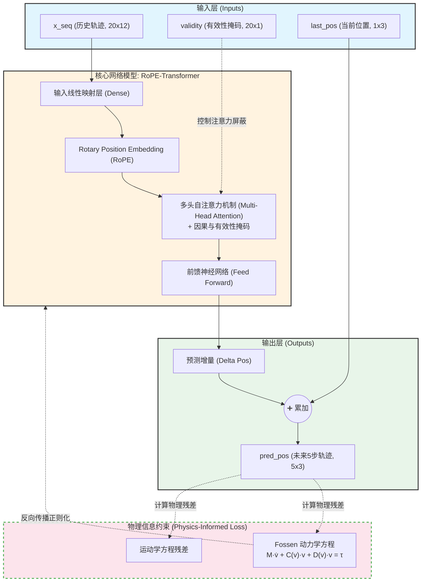

# 基于PINN的AUV轨迹预测模型架构

您可以使用 VS Code 的 Markdown 预览功能（快捷键 `Ctrl + Shift + V`，或者右键点击编辑器选择“打开侧边栏预览”）来查看渲染后的结构图。

```mermaid
graph TD
    %% 数据输入部分
    subgraph Input ["输入层 (Inputs)"]
        X["x_seq (历史轨迹, 20x12)"]
        V["validity (有效性掩码, 20x1)"]
        L["last_pos (当前位置, 1x3)"]
    end

    %% 特征提取与Transformer部分
    subgraph Transformer ["核心网络模型: RoPE-Transformer"]
        Linear1["输入线性映射层 (Dense)"]
        RoPE["Rotary Position Embedding (RoPE)"]
        Attention["多头自注意力机制 (Multi-Head Attention)<br/>+ 因果与有效性掩码"]
        FFN["前馈神经网络 (Feed Forward)"]
        Linear1 --> RoPE
        RoPE --> Attention
        Attention --> FFN
    end

    %% 预测与输出
    subgraph Output ["输出层 (Outputs)"]
        Pred["预测增量 (Delta Pos)"]
        Add(("➕ 累加"))
        Final["pred_pos (未来5步轨迹, 5x3)"]
    end

    %% 物理约束部分(PINN)
    subgraph PINN ["物理信息约束 (Physics-Informed Loss)"]
        Fossen["Fossen 动力学方程<br/>M·v̇ + C(v)·v + D(v)·v = τ"]
        Kine["运动学方程残差"]
    end

    %% 连接关系
    X --> Linear1
    V -.->|控制注意力屏蔽| Attention
    
    FFN --> Pred
    Pred --> Add
    L --> Add
    Add --> Final

    %% 损失函数流向
    Final -.->|计算物理残差| Fossen
    Final -.->|计算物理残差| Kine
    Fossen -.->|反向传播正则化| Transformer
    
    classDef input fill:#e1f5fe,stroke:#333,stroke-width:2px;
    classDef network fill:#fff3e0,stroke:#333,stroke-width:2px;
    classDef output fill:#e8f5e9,stroke:#333,stroke-width:2px;
    classDef pinn fill:#fce4ec,stroke:#4caf50,stroke-width:2px,stroke-dasharray: 5 5;

    class Input input;
    class Transformer network;
    class Output output;
    class PINN pinn;
```
